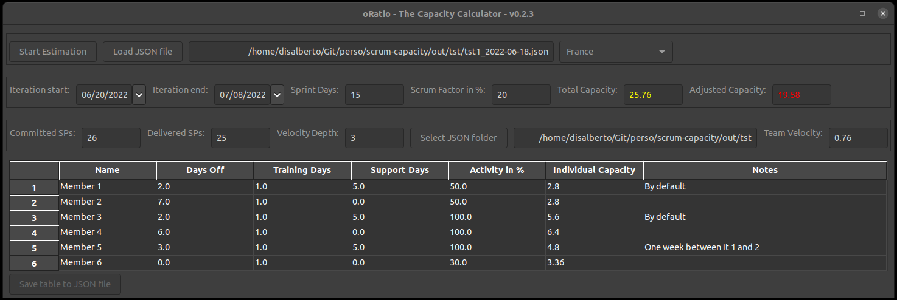

# oRatio - The Capacity Calculator

## The need
This small software has been designed and developed to ease the activity of a ***Scrum Master***,
or anyone who has to deal with a team and its capacity.

## Start Estimation
- For the first execution, it's mandatory to start a new estimation, that can be then reused as a base
for future iterations.

- The user is asked to specify **how many people are there in the team**.
Once confirmed, a table is shown with default pre-filled values.

- In the top left corner, the user has to select the base country of the team.
This will be used to retrieve the good bank-holidays.
  - *Current limitation*: if someone in the team is working from another country, a different bank-holiday
  must be treated as a day off.
- The user has to specify the start and end dates of the iteration for which the estimation is needed.
Sprint/Iteration days are automatically calculated, taking into account weekends and bank holidays.
  - The result can be manually forced to another value,
  in order to handle corner cases (i.e. company-specific day off or regional vacations).
- The **Scrum Factor in %** is the impact of SCRUM in your team: how much time in % is reserved
to Agile meetings (Daily Stand-up, Planning, Sprint Review,...).
  - It's by default set to 20%.
- For each team member, the user can specify:
  - A name
  - The number of days off
  - The number of days the member will be involved in trainings
  - The number of days the member will be involved in support/maintenance activity
  - The % of activity in the team:
    - For example a user could be DEV at 50% and Scrum Master for the remaining 50%.
    In this case his/her (dev) Activity would be 50%.
  - Notes/Comments, if needed.
- The capacity is automatically filled for each team member and the sum for all members is then reported in
the **Total Capacity** text area (top-right corner).
  - Its color can vary from red to green, depending on the underlying value:
    - Red: < 20 Story Points
    - Yellow: 20 SP < Capacity < 40 SP
    - Green: > 40 Story Points
- Once satisfied with the current estimation, the user can save the filled content with the dedicated button
in the bottom-left part of the UI.
  - The current date and the extension will be automatically appended to the chosen filename.

## Load JSON File
- An old estimation can be loaded to make adjustments or to be used as a base for a new one, to save some time.

## Team velocity
The total capacity, based on each team member's individual capacity, can be adjusted based on the actual team's velocity.

- The information on a given iteration can be complemented, adding the committed and delivered story points.

  - These additional information are added in the json file, once the estimation is saved.
  - If the information on committed and delivered story points are not filled, the json file is skipped for the velocity calculation.

- The user can choose the source folder of the json files to be used for computing the velocity by clicking on the *Select JSON folder* button.

- The *iteration velocity* is the result of division of the delivered and committed story points. The *team's velocity* is the average of the N iteration velocities, where N is the *Velocity Depth*.

  - The user can decide how many iterations to take into account for computing the team velocity by modifying the corresponding text field.
  - By default 3 iterations are used.

Once the team's velocity is calculated, its value is shown in the right part of the window and the value of the *Adjusted Capacity* is filled.

- It is the product of the total capacity and the team's velocity.

## Pre-commit & Commitizen
Some pre-commit checks are performed (pylint, black,...). On a recently cloned repo:
- **pre-commit install --hook-type commit-msg**
  - to set up the git hook scripts (more info [here](https://pre-commit.com/#install))
- **pre-commit run --all-files**
  - to run prec-commit checks on all files.
 

Semantic versioning is handled by **commitizen** (see [here](https://commitizen-tools.github.io/commitizen/))
- Conventions must be used in the conmit message and the new version is chosen depending on the message prefix.
- To update the changelog: **cz bump --changelog**
  - New version, tag and changelog entry after each new commit/push

## Wishlist for future releases
* Capacity with velocity integration -> some diagrams?
* Rename file with date issue
* Add/remove team members
